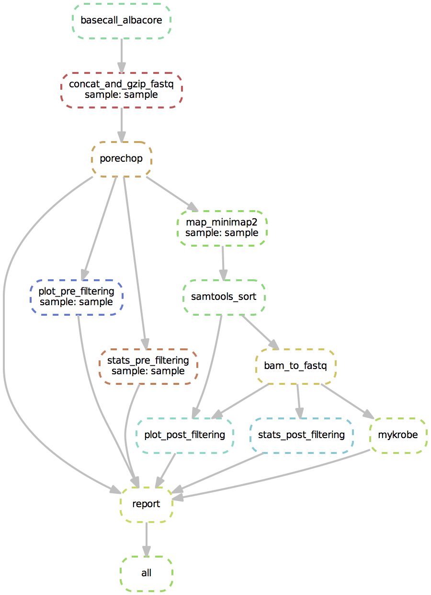
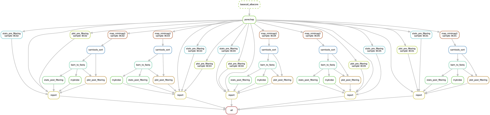

**This pipeline is archived and is now hosted and maintained at https://github.com/iqbal-lab-org/Mykrobe_tb_workflow**

========================================
Analysis pipeline for *M. tuberculosis*
========================================
This repository is designed to analyse Oxford Nanopore Technologies sequence data.
Specifically, for drug resistance prediction with `Mykrobe predict`_.

To achieve this, the pipeline does the following:

1. Basecalling of raw nanopore sequencing files (if required. However it is strongly recommended you do this yourself with Guppy).
2. Adapter trimming of the basecalled reads (and demultiplexing if required).
3. Alignment to the *M. tuberculosis* reference genome and removal of unmapped reads.
4. Drug resistance prediction with Mykrobe predict.
5. Final report with plots and statistics, along with the Mykrobe results.

Installation
========================================
**Note: the following instructions assume you are working on a Linux operating system and have Python version 3.5 or greater.**

The first thing to do is download this repository onto the machine you want to run the analysis on. In the spirit of making everything reproducible and tidy I would advice to download this repository (or copy the blank version) once for each nanopore experiment you want to analyse.

Let's create our experiment directory and clone the pipeline.

.. code-block:: bash

    experiment=sample1
    git clone https://github.com/mbhall88/Longitude_pipeline.git "$experiment"

This will download the pipeline repository into a directory named, in this case, ``sample1``.

Install Singularity
---------------------
The next thing we need to do is install Singularity_. This is a program that allows for building and executing of software containers (tiny self-contained computers with pre-installed software). If you run ``singularity --help`` from the command line and get an error mesage, then you will need to install. This repository comes with a script to this, however if for some reason that doesn't work, there are more `detailed instructions here`_. **Note:** you will need to have 'root' access on the machine you are working on in order to complete the installation. If you don't have such access then contact your systems adminstrator.

.. code-block:: bash

    sudo ${experiment}/scripts/install_singularity.sh
    singularity --help

You should now get the Singularity help menu.

Install Snakemake
---------------------
Snakemake_ is a workflow management system which coordinates the running of this pipeline. In order to install it you will need to make sure you have Python3_ installed (run ``python3 -V`` to confirm this). To install, run the following.

.. code-block:: bash

    pip3 install snakemake docutils

Note: ``docutils`` is also required in order to generate the reports at the end.

Setup
========================================
Getting Singularity containers
--------------------------------
Now we need to obtain the Singularity containers required for the pipeline to work. These are not distributed with the repository as they are quite large. There are two ways of getting these containers. One is to pull pre-built version from Singularity Hub (recommended), but if for some reason this does not work the recipe files to build them from scratch are provided.

To pull them from Singularity Hub (recommended):

.. code-block:: bash

    cd "$experiment"
    # store the directory of the project for later use
    project_dir=$(pwd)
    cd ${project_dir}/containers
    singularity pull --force --name nanoporeqc.simg shub://mbhall88/Singularity_recipes:nanoporeqc
    singularity pull --force --name mykrobe.simg shub://mbhall88/Singularity_recipes:mykrobe

If you need a container for basecalling with Albacore, please contact me.

If one of these fails, you can build from scratch. Let's say in the above the container named `mykrobe.simg` failed. To build this from scratch we use the recipe `Singularity.mykrobe` inside the `recipes` directory to build from:

.. code-block:: bash

    sudo singularity build mykrobe.simg recipes/Singularity.mykrobe

It will take a few minutes for each container to build from scratch.

If you will be using this pipeline on multiple different experiments than it is probably best if you put these containers in a central location. Due to their large size (~1GB each) downloading them for each experiment would be a waste of space. If you prefer to take this route then see the containers instructions in the `Config file`_ section below.

Moving/copying reads into correct directory
--------------------------------------------
The pipeline expects that the data is placed in specific directories. Whilst this may seem a bit rigid, it is all in the name of reproducibility.

**Non-barcoded sample**

If you have already basecalled your reads then you will only need to merge the fastq files produced by the basecaller. To do this

.. code-block:: bash

    # make the directory we will move the merged file into
    mkdir -p ${project_dir}/data/basecalled
    cd /path/to/basecalled/fastq_files
    cat *.fastq | gzip > ${project_dir}/data/basecalled/${experiment}.fastq.gz
    cd ${project_dir}

This will combine all of the fastq files into a single, compressed file named according to the experiment name and move it into our basecalled data directory.

**Barcoded sample**

If you are working with multiplexed samples (barcoded) then your directory that the basecalling was done into should contain subdirectories named after the barcode they were binned into by the basecaller. You will need to move these directories (in exampe below) to a directory in the experiment pipeline. If you did not select the barcoding option for basecalling, but the samples are barcoded, then do the following for the fastq files produced by the basecalling. Note: we only work with files in the "pass" directory (if there is one).

.. code-block:: bash

    # make the directory we will move the reads into
    mkdir -p ${project_dir}/data/basecalled/workspace/pass
    cd ${project_dir}/data/basecalled/workspace/pass
    mv /path/to/dir/containing/barcode/dirs/* .
    cd ${project_dir}

**Basecalling required**

**NOTE**: Basecalling from this pipeline only supports Albacore. It is suggested you basecall with Guppy yourself as this will be much faster. The Albacore basecalling option is only provided for cases where Guppy is not working.

If basecalling is required from the pipeline then you need to do two things. First, change the ``basecall`` field to ``true`` within the config file (see below). Second, move your fast5 files into the pipeline directory.

.. code-block:: bash

    # make the directory we will move the reads into
    mkdir -p ${project_dir}/data/reads
    cd ${project_dir}/data/reads
    mv /path/to/dir/containing/fast5/files/* .
    cd ${project_dir}

If they are multiplexed then you must fill in the appropriate fields in the config file (see below).

Config file
--------------
The only file you should need to alter within the pipeline is ``config.yaml``. Open this file up in a text editor and change the following fields, if necessary:

* **multiplexed** - Default is ``false``. Change to ``true`` if sample is multiplexed. If set to ``true`` then you **MUST** enter information for ``barcodes`` as well (see below).
* **sample_name** - If ``multiplexed`` is set to ``false`` then this is the name of your sample. **Note: this MUST be the value of** ``experiment`` **we defined at the start of the installation instructions**. If ``multiplexed`` is set to ``true`` then ignore this field.
* **barcodes** - If ``multiplexed`` is set to ``true`` then this needs to be a **space-separated** string of the expected barcodes (the ones you used in the experiment). An example of barcodes 01-05 is provided. These **MUST** follow the same format of ``BC`` followed by 2 digits. If ``multiplexed`` is set to ``false`` then ignore this field.
* **basecall** - If you have not previously basecalled your data and want to do so as part of the pipeline then set the value to ``true`` and basecalling will be done with albacore. Default is ``false``.
* **threads** - Maximum number of threads to use for each process. Default is 1.
* **tb_reference** - You shouldn't need to change this as the latest reference comes with the repository.
* **flowcell** - You should only need to fill this in if you are also using this pipeline to basecall. The flowcell used (if known). Default is "FLO-MIN106"
* **kit** - You should only need to fill this in if you are also using this pipeline to basecall. The sequencing kit used (if known). Default is "SQK-LSK108"
* **containers** - If you have downloaded/built the Singularity containers elsewhere as you will be using them for multiple samples then change the paths for each container to the location you have them stored at. If you want to avoid changing this you could symlink the containers into the pipeline ``containers/`` directory.

Run
======
You are all set up now. To run the pipeline simply execute the following

.. code-block:: bash

    cd ${project_dir}
    snakemake --use-singularity

This can take a little while to run. At the end you should have a report HTML file in the main project directory (one for each barcode if multiplexed). All intermediate files, that were kept, can be found within the subdirectories of ``data/``.

Visualisation of pipeline
==========================
Without demultiplexing
-----------------------
If basecalling is not requested then the pipeline starts at ``porechop``.

With demultiplexing
---------------------
If basecalling is not requested then the pipeline starts at ``porechop``.

.. _`Mykrobe predict`: http://www.mykrobe.com/products/predictor/
.. _Singularity: http://singularity.lbl.gov/
.. _`detailed instructions here`: http://singularity.lbl.gov/install-linux
.. _Snakemake: https://snakemake.readthedocs.io/en/stable/index.html
.. _Python3: https://www.python.org/downloads/source/
